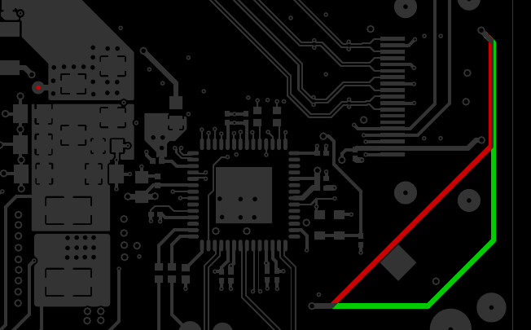

# Kiff, the Kicad diff
Graphically compare layout changes between two git versions of a PCB.

If `-c` is not given, compares the local working copy against the latest
commited version from git. This is useful to verify board changes before
committing them.

If a git commit-id is given in `-c`, will compare the local version
against this commit. This is useful to compare changes between 2 commits.

A useful shortcut for the commit-id is `HEAD~1`, which means the previous one.

Elements which have been added in the local version are colored green,
removed ones red.
Note that this may look inverted for features on copper fills.

# Requires
  * `poppler-utils` to convert the Kicad .pdf plots to bitmaps
  * `python-pil` and `python-numpy` for image manipulations
  * `kiff.py` needs to be in your path

Tested to work with Python 2 and 3. To enable scripting with Python 3, Kicad needs to be compiled with `-DKICAD_SCRIPTING_PYTHON3=TRUE`.

# Usage example
Compare the current version against the one from 3 commits ago:

```bash
$ cd <kicad_project>
$ kiff.py my_pcb.kicad_pcb -c HEAD~3
```

This will generate `diffs/<layer_name>.png` for each layer.



It works by using `plot_layers.py` to make Kicad plot each layer of each version as `.pdf` into 2 temporary directories.
Then `pdftoppm` is called to crop the pdfs and convert them to bitmap. Bitmap data is read by `PIL` over stdin and the diff image is created in python using numpy arrays.
